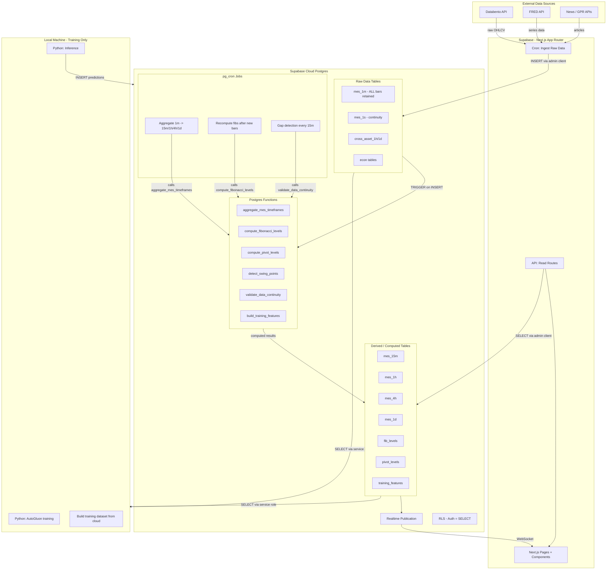

# Warbird-Pro: Supabase Architecture Rethink

> ARCHIVED REFERENCE ONLY. Do not update this file.  
> Active architecture/update doc: `docs/plans/2026-03-20-ag-teaches-pine-architecture.md`

**Date:** 2026-03-19
**Status:** Draft — Pending Kirk Review
**Constraint:** Docker available but NOT running continuously. RAM reserved for ML training. Supabase CLI uses `--linked` mode against cloud project. No persistent local Postgres.

## Confirmed Architecture Direction

This section supersedes the earlier cloud-first framing further below until the full document is rewritten.

### Confirmed decisions

- Drop `mes_1s` from the retained training architecture.
- Keep `mes_1m` as the canonical retained local bar layer for training.
- If live bar formation is needed, use a separate **ephemeral live-feed path** only for the currently forming chart bar.
- Use **local TimescaleDB** as the primary recommendation because it is the strongest fit for local-first time-series ingestion, aggregation, and retained training history.
- Keep **plain local PostgreSQL** as the fallback if extension friction or operational simplicity wins.
- Keep **Supabase cloud** as the publication boundary for auth, dashboard reads, realtime, and curated published outputs.
- Keep **Docker usage sparse and on-demand only**.
- Keep **Inngest out**.
- Keep all new naming aligned to the existing `mes_`, `cross_asset_`, `econ_`, and `warbird_` rules.

### Training and inference boundary

- Build immutable local feature snapshots before model training.
- Train AutoGluon 1.5 locally from those feature snapshots.
- Run inference locally first.
- Publish only curated inference and dashboard-ready outputs to cloud Supabase.

### Cost boundary

- No new paid data plan beyond the existing Databento subscription.
- `mes_1s` should not be retained for training.
- Any live-feed path should exist only to support realtime chart-bar formation, not as a second retained warehouse.

---

## Current State Assessment

### What Exists (Spotty)

The project has **schema definitions** (12 migrations) and **stub routes** (21 cron jobs, 5 API routes), but the data pipeline is largely empty. Here's the honest audit:

| Layer             | Status                           | Problem                                                                                                     |
| ----------------- | -------------------------------- | ----------------------------------------------------------------------------------------------------------- |
| MES 1m ingestion  | Cron route exists                | Only fetches rolling window via Databento Historical. No retention strategy for training.                   |
| MES 15m/1h/4h/1d  | Aggregation exists in TypeScript | Derived in-memory in cron route, not in DB. No Postgres functions.                                          |
| Cross-asset       | Cron route exists                | Only fetches hourly snapshots. No deep history.                                                             |
| FRED / Econ       | Cron routes exist                | 10 categories defined but unclear if any data populated.                                                    |
| Warbird layers    | 8 tables defined                 | Forecast, trigger, conviction, risk, daily bias, structure, setups, events — all empty until pipeline runs. |
| Training pipeline | Python scripts exist             | Scripts read from cloud Supabase. No local DB. Fragile.                                                     |
| Middleware        | Broken                           | `proxy.ts` not `middleware.ts`. Auth sessions not refreshing.                                               |
| Type safety       | None                             | No `supabase gen types`. Manual type casts everywhere.                                                      |
| DB functions      | Zero                             | All computation in TypeScript/Python. Nothing in Postgres.                                                  |

### What's Missing for a Real Financial Data Pipeline

1. **No `pg_cron` usage** — All scheduling via Supabase pg_cron (external). Supabase has built-in `pg_cron` + `pg_net` for zero-latency DB-native scheduling.
2. **No Postgres aggregation functions** — 1m → 15m → 1h → 4h → 1d aggregation is done in TypeScript, not as DB triggers or functions.
3. **No materialized views** — No pre-computed query results for dashboard or chart.
4. **No 1m bar retention policy** — Bars are ingested but no explicit retention. Need ALL 1m bars for training.
5. **No feature engineering in DB** — Fibonacci, pivots, swing detection, measured moves all computed in TypeScript at request time.
6. **No data completeness validation** — No DB-level gap detection or continuity checks.
7. **No Supabase Edge Functions** — Could replace Supabase pg_cron for DB-adjacent work.

---

## Reference Architecture: Well-Architected Supabase + Next.js Financial Data Pipeline

### Guiding Principles

1. **Push compute to the database** — Postgres is where the data lives. Aggregation, feature engineering, and data validation should happen as close to the data as possible.
2. **Use `pg_cron` for DB-internal scheduling** — Zero network latency. No external cron dependency for data-only work.
3. **Use Supabase pg_cron only for external API calls** — Databento, FRED, news APIs need HTTP access that `pg_cron` + `pg_net` can handle, but Supabase routes are better for complex API parsing.
4. **Cloud-only, no Docker** — Use Supabase cloud project directly. Manage migrations via `supabase db push` from CLI linked to cloud project, or apply via Dashboard SQL editor.
5. **Keep all 1m bars** — `mes_1m` is canonical training data. Never truncate.
6. **Type generation from schema** — Run `supabase gen types typescript --linked` to get compile-time safety.

### Target Architecture



### Layer-by-Layer Design

#### Layer 1: Ingestion — Keep What Works

The current Supabase pg_cron approach for external API calls is fine. These routes need HTTP access to Databento, FRED, etc. Keep them, but simplify:

- **Supabase pg_cron routes** handle ONLY raw data fetching and INSERT
- Remove all computation logic from cron routes
- After INSERT, Postgres triggers fire automatically

#### Layer 2: Postgres Functions — Move Compute to DB

Create PL/pgSQL functions for all data transformations:

| Function                   | Trigger                                | Purpose                              |
| -------------------------- | -------------------------------------- | ------------------------------------ |
| `aggregate_1m_to_15m`      | After INSERT on `mes_1m`               | Builds/updates 15m bars from 1m data |
| `aggregate_1m_to_1h`       | After INSERT on `mes_1m`               | Builds/updates 1h bars               |
| `aggregate_1h_to_4h`       | After INSERT on `mes_1h`               | Builds/updates 4h bars               |
| `aggregate_1h_to_1d`       | After INSERT on `mes_1d`               | Builds/updates daily bars            |
| `compute_fibonacci_levels` | Called by `pg_cron` after aggregation  | Multi-period fib geometry            |
| `compute_pivot_levels`     | Called by `pg_cron` daily              | Floor/R1/R2/S1/S2 pivots             |
| `detect_swing_points`      | Called by `pg_cron` after new 15m bars | Swing high/low detection             |
| `validate_data_continuity` | Called by `pg_cron` every 15m          | Gap detection, missing bar alerts    |
| `build_training_features`  | Called on demand or daily              | Builds feature row from all inputs   |

#### Layer 3: `pg_cron` — DB-Native Scheduling

Replace some Supabase Crons with `pg_cron` for DB-only work:

```sql
-- Aggregate 1m bars every 5 minutes
SELECT cron.schedule('aggregate-mes', '*/5 * * * *',
  'SELECT aggregate_1m_to_all_timeframes()');

-- Recompute fibonacci after market hours
SELECT cron.schedule('compute-fibs', '*/15 * * * 1-5',
  'SELECT compute_fibonacci_levels()');

-- Data continuity check
SELECT cron.schedule('validate-continuity', '*/15 * * * *',
  'SELECT validate_data_continuity()');
```

#### Layer 4: 1m Bar Retention — Keep Everything

- Remove any TTL or cleanup on `mes_1m`
- Add table partitioning by month for query performance:

```sql
-- Partition mes_1m by month for efficient range queries
CREATE TABLE mes_1m (
  ts timestamptz NOT NULL,
  open numeric NOT NULL,
  ...
) PARTITION BY RANGE (ts);

CREATE TABLE mes_1m_2025_01 PARTITION OF mes_1m
  FOR VALUES FROM ('2025-01-01') TO ('2025-02-01');
```

#### Layer 5: Type Generation

```bash
# Link to cloud project (no Docker needed)
supabase link --project-ref YOUR_PROJECT_REF

# Generate types from cloud schema
supabase gen types typescript --linked > lib/supabase/database.types.ts
```

Then use in all queries:

```typescript
import type { Database } from '@/lib/supabase/database.types';
const supabase = createClient<Database>(...);
```

#### Layer 6: Training Pipeline — Python reads from Cloud

```python
# Python scripts connect to cloud Supabase (same as now but reads from richer feature tables)
supabase.table('training_features').select('*').gte('ts', start).execute()
```

The key change: instead of Python computing features from raw 1m bars, the DB has already computed and stored them.

---

## What Stays vs What Changes

### Keep

- Supabase pg_cron for external API ingestion (Databento, FRED, news)
- Supabase cloud project as single source of truth
- Next.js App Router for frontend
- Lightweight Charts for MES chart
- RLS policy pattern (authenticated = SELECT)
- Realtime for chart updates

### Change

- **Move aggregation to Postgres functions** — not TypeScript
- **Add `pg_cron`** for DB-internal scheduling
- **Add data continuity validation** in DB
- **Keep ALL 1m bars** — add partitioning
- **Generate TypeScript types** from schema
- **Fix middleware** — rename `proxy.ts` to `middleware.ts`
- **Add `.env.example`** completeness
- **Feature engineering in DB** — fib, pivot, swing as Postgres functions
- **Training features table** — pre-computed feature rows for ML

### Remove / Simplify

- TypeScript aggregation in cron routes (replaced by DB triggers)
- In-memory fib/pivot computation in API routes (replaced by DB reads)
- Complex setup-engine.ts state machine running in Supabase (consider moving to DB)

---

## No-Docker Workflow

Since you don't want Docker, here's how this works:

1. **Supabase CLI linked to cloud** — `supabase link` connects to your cloud project
2. **Migrations via CLI** — `supabase db push` applies local migration files to cloud
3. **Type generation** — `supabase gen types typescript --linked` pulls from cloud schema
4. **SQL editor** — Write and test Postgres functions in Supabase Dashboard SQL editor
5. **`pg_cron` management** — Set up via Dashboard Integrations → Cron, or via SQL

No local Postgres. No Docker. Everything runs in cloud. The tradeoff: you're developing against production (or a separate "staging" Supabase project if you create one).

---

## Implementation Matrices To Fold Into Execution

This section translates the architecture into the concrete boundaries another mode should implement.

### Connection Topology Matrix

| Runtime / process                | Primary database target               | Purpose                                                    | Notes                                             |
| -------------------------------- | ------------------------------------- | ---------------------------------------------------------- | ------------------------------------------------- |
| Local ingestion jobs             | Local PostgreSQL or local TimescaleDB | Raw ingest, validation, retained history                   | This becomes the system of work                   |
| Local SQL functions / aggregates | Local PostgreSQL or local TimescaleDB | Higher timeframe bars, feature generation, QA checks       | Run close to the retained data                    |
| Local training scripts           | Local PostgreSQL or local TimescaleDB | Read immutable `training_features` snapshots               | No cloud dashboard reads in the training hot path |
| Local inference scripts          | Local PostgreSQL or local TimescaleDB | Score the newest local feature rows                        | Write local inference first                       |
| Local publish job                | Both local DB and cloud Supabase      | Read curated local outputs and upsert published cloud rows | Narrow and explicit sync contract                 |
| Next.js dashboard runtime        | Cloud Supabase only                   | Auth, dashboard reads, realtime subscriptions              | No dependency on local training warehouse         |
| Cloud API read routes            | Cloud Supabase only                   | Lightweight publication-layer APIs                         | Read from published tables only                   |

### URL / credential boundary

The final implementation should explicitly separate these environment groups:

- **Local database URL** for local ingest, local aggregates, local training, and local inference
- **Cloud Supabase URL + keys** for publication, dashboard APIs, auth, and realtime
- **No ambiguous mixed-use URL setup** where the same runtime quietly flips between local and cloud without an explicit role

That means [`.env.example`](.env.example) should eventually document separate local and cloud groups instead of only a minimal cloud-only shape.

### API Scaffolding Matrix

| Area                                                                   | Keep                                       | Change                                                                                                      |
| ---------------------------------------------------------------------- | ------------------------------------------ | ----------------------------------------------------------------------------------------------------------- |
| [`app/api/cron/`](app/api/cron)                                        | Keep the external-feed scaffolding concept | Shrink cloud cron routes so they are publication or remote-trigger paths, not the main local compute engine |
| [`app/api/live/mes15m/route.ts`](app/api/live/mes15m/route.ts)         | Keep a chart snapshot API                  | Point it at published cloud chart data or a published chart window, not the full local warehouse            |
| [`app/api/warbird/signal/route.ts`](app/api/warbird/signal/route.ts)   | Keep signal read surface                   | Read published cloud signals, not raw training tables                                                       |
| [`app/api/warbird/history/route.ts`](app/api/warbird/history/route.ts) | Keep history read surface                  | Serve published signal and setup history                                                                    |
| [`app/api/admin/status/route.ts`](app/api/admin/status/route.ts)       | Keep system-health intent                  | Split future health views into local pipeline health versus cloud publication health                        |

### Local execution ownership matrix

The plan now assumes these responsibilities move or stay local:

| Responsibility               | Local owner                                                       |
| ---------------------------- | ----------------------------------------------------------------- |
| Raw market ingest            | local ingest jobs                                                 |
| Higher timeframe aggregation | local SQL functions, continuous aggregates, or materialized views |
| Feature engineering          | local SQL or local feature-build scripts                          |
| Training dataset assembly    | local database plus local training scripts                        |
| Model fitting                | local AutoGluon pipeline                                          |
| Inference                    | local inference scripts                                           |
| Cloud publication            | local sync job                                                    |

### Script Ownership Matrix

| Script area                                                                            | Future ownership                                                                                                |
| -------------------------------------------------------------------------------------- | --------------------------------------------------------------------------------------------------------------- |
| [`scripts/backfill.py`](scripts/backfill.py)                                           | local historical ingest and rebuild                                                                             |
| [`scripts/build-dataset.py`](scripts/build-dataset.py)                                 | local dataset builder or transitional feature export path                                                       |
| [`scripts/train-warbird.py`](scripts/train-warbird.py)                                 | local AutoGluon training                                                                                        |
| [`scripts/warbird/train-warbird.py`](scripts/warbird/train-warbird.py)                 | local canonical model training                                                                                  |
| [`scripts/warbird/predict-warbird.py`](scripts/warbird/predict-warbird.py)             | local inference                                                                                                 |
| [`scripts/warbird/build-warbird-dataset.ts`](scripts/warbird/build-warbird-dataset.ts) | local feature-building support until SQL ownership is finalized                                                 |
| [`scripts/live-feed.py`](scripts/live-feed.py)                                         | do not reuse as a permanent production dependency; if replaced, keep any new live path ephemeral and chart-only |

### Schema Transition Map

#### Local retained schema

These belong in the retained local warehouse:

- canonical raw `mes_1m`
- local cross-asset raw and derived series
- local economic raw and derived series
- higher timeframe MES tables such as `mes_15m`, `mes_1h`, `mes_4h`, `mes_1d`
- engineered local tables such as `pivot_levels`, `fib_levels`, `swing_points`, `training_features`
- local inference and model metadata tables

#### Local ephemeral schema or stream

These are allowed only for operational responsiveness and should not become retained training truth by accident:

- live currently-forming chart bar state
- any transient live-feed cache used only to make bar formation appear realtime

#### Cloud published schema

These belong in cloud Supabase:

- published signals
- published setup state and setup events
- dashboard summary tables
- published chart window if the frontend needs cloud-served chart snapshots
- auth and realtime-facing tables required by the UI

### Architectural consequence

Another mode implementing this plan should treat the repository as a **dual-database system**:

1. local PostgreSQL or local TimescaleDB as the training and inference warehouse
2. cloud Supabase as the publication and dashboard layer

That boundary now explicitly covers DB URLs, API scaffolding, training / inference scripts, and schema responsibilities.

---

## Autonomous Execution Checkpoints For Claude With Ralph-Loops

This section is for an autonomous implementation pass. It marks where Claude should **stop, think, research online, compare options, document reasoning, and only then proceed**.

### Ralph-loop pattern

For every checkpoint below, use this loop:

1. **Read local context first**
2. **Check online for current best practice**
3. **Compare at least 2 viable options**
4. **Choose the simpler option unless the stronger option has a clear material advantage**
5. **Write down the reason for the choice**
6. **Verify the choice against [`AGENTS.md`](AGENTS.md), [`WARBIRD_CANONICAL.md`](WARBIRD_CANONICAL.md), cost limits, and naming rules**
7. **Only then implement**

### Reasoning guardrails

Claude should apply these guardrails throughout implementation:

- Prefer **less complexity, fewer moving parts, better naming**
- Do not add any dependency, extension, or vendor plan without an explicit reason
- Do not violate the cloud production boundary by making dashboards depend on a continuous local runtime
- Do not let ephemeral live-bar logic become retained training truth
- Do not introduce `v2`, `new`, `final`, or similarly weak naming patterns
- Do not silently increase Databento cost exposure
- Do not assume old code paths should survive if the architecture boundary makes them obsolete
- Do not keep both old and new paths alive unless there is a clear migration reason

### Checkpoint 1: Local database choice

Claude must explicitly reason through:

- local TimescaleDB versus plain local PostgreSQL
- extension risk versus time-series capability
- operational simplicity versus continuous aggregate strength

Decision rule:

- choose **TimescaleDB** only if the operational overhead remains acceptable and the benefit to local ingest plus derived bar management is meaningful
- otherwise choose plain PostgreSQL with declarative partitioning and materialized views

Required deliverable:

- a short decision note explaining why the chosen local database is stronger for this repo

### Checkpoint 2: Live bar formation path

Claude must reason through:

- how to get realtime bar formation without reintroducing retained `mes_1s`
- whether the live path should come from a transient stream, ephemeral local cache, or a narrow published live window
- how to keep chart responsiveness high without contaminating the retained training warehouse

Decision rule:

- live-bar logic must be **ephemeral and chart-only** unless a hard training reason emerges later

Required deliverable:

- a clear separation between retained `mes_1m` truth and live forming-bar state

### Checkpoint 3: DB URL and credential topology

Claude must reason through:

- how local jobs connect to the local database
- how publish jobs connect to cloud Supabase
- how Next.js routes and dashboard reads stay cloud-only
- how environment variables should be grouped to avoid accidental cross-wiring

Decision rule:

- any runtime should have one obvious primary database target
- dual-target code is allowed only in explicit publication or migration jobs

Required deliverable:

- an env matrix and runtime-to-database matrix

### Checkpoint 4: API scaffolding retention versus removal

Claude must reason through each route family under [`app/api/`](app/api):

- keep as-is
- shrink to publication-only
- move responsibility local
- delete because it no longer fits the architecture

Decision rule:

- do not preserve routes just because they already exist
- preserve only routes that still serve the final architecture cleanly

Required deliverable:

- a route matrix with keep, shrink, move, or remove decisions and reasons

### Checkpoint 5: Schema ownership

Claude must reason through every schema area and classify it as:

- retained local raw
- retained local derived
- local ephemeral live-only
- cloud published

Decision rule:

- if a table exists primarily for training, feature generation, or experimentation, it belongs local
- if a table exists primarily for auth, dashboard reads, or published signal delivery, it belongs cloud

Required deliverable:

- a schema ownership map before major migration work begins

### Checkpoint 6: AutoGluon 1.5 training design

Claude must reason through:

- how immutable `training_features` rows are produced
- which targets and horizons should be separate models
- whether current presets in [`scripts/train-warbird.py`](scripts/train-warbird.py) and [`scripts/warbird/train-warbird.py`](scripts/warbird/train-warbird.py) remain appropriate
- when to use deployment optimization versus research optimization

Decision rule:

- favor reproducibility and leakage control over model novelty
- do not optimize latency before the feature table and publish contract are stable

Required deliverable:

- a training design note tied to actual script changes and actual feature-table ownership

### Checkpoint 7: Cost and subscription safety

Claude must reason through:

- whether any proposed feed, frequency, or live path increases cost beyond the current Databento subscription
- whether a higher-frequency path materially improves outcomes enough to justify local processing cost

Decision rule:

- if the same outcome is achievable with retained `mes_1m`, choose `mes_1m`
- do not introduce a design that requires a higher paid plan without explicit approval

Required deliverable:

- a short cost-safety check for any live-data decision

### Checkpoint 8: Migration and cutover safety

Claude must reason through:

- whether old and new paths must coexist temporarily
- what can be switched atomically
- which migrations are safe online versus requiring staged rollout

Decision rule:

- prefer reversible, incremental cutovers
- avoid partial architecture states where cloud routes depend on unfinished local publication logic

Required deliverable:

- a cutover sequence with rollback points

### Checkpoint 9: Final validation judgement

Before concluding implementation, Claude must explicitly judge whether the result satisfies all of these:

- local-first training architecture is real, not nominal
- cloud dashboard layer is truly decoupled from continuous local compute
- retained training history is local and reproducible
- naming stays canonical
- cost boundaries remain intact
- realtime chart behavior is supported without corrupting training truth

If any of those are not true, Claude should reopen the relevant checkpoint, rethink, re-check online, and revise before declaring the work complete.

---

## Reference Resources

There is no single open-source "financial data pipeline on Supabase" template. However, the best-practice patterns come from:

1. **Supabase official docs** — [Database Functions](https://supabase.com/docs/guides/database/functions), [pg_cron](https://supabase.com/docs/guides/cron), [Realtime](https://supabase.com/docs/guides/realtime)
2. **Supabase Next.js starter** (what warbird-pro was scaffolded from) — Auth + SSR patterns
3. **TimescaleDB patterns** — Time-series partitioning, continuous aggregates (Supabase Postgres supports partitioning but not TimescaleDB hypertables)
4. **pg_cron + pg_net** — Supabase's built-in cron + HTTP request from within Postgres
5. **Supabase CLI** — `supabase gen types`, `supabase db push`, `supabase link`
