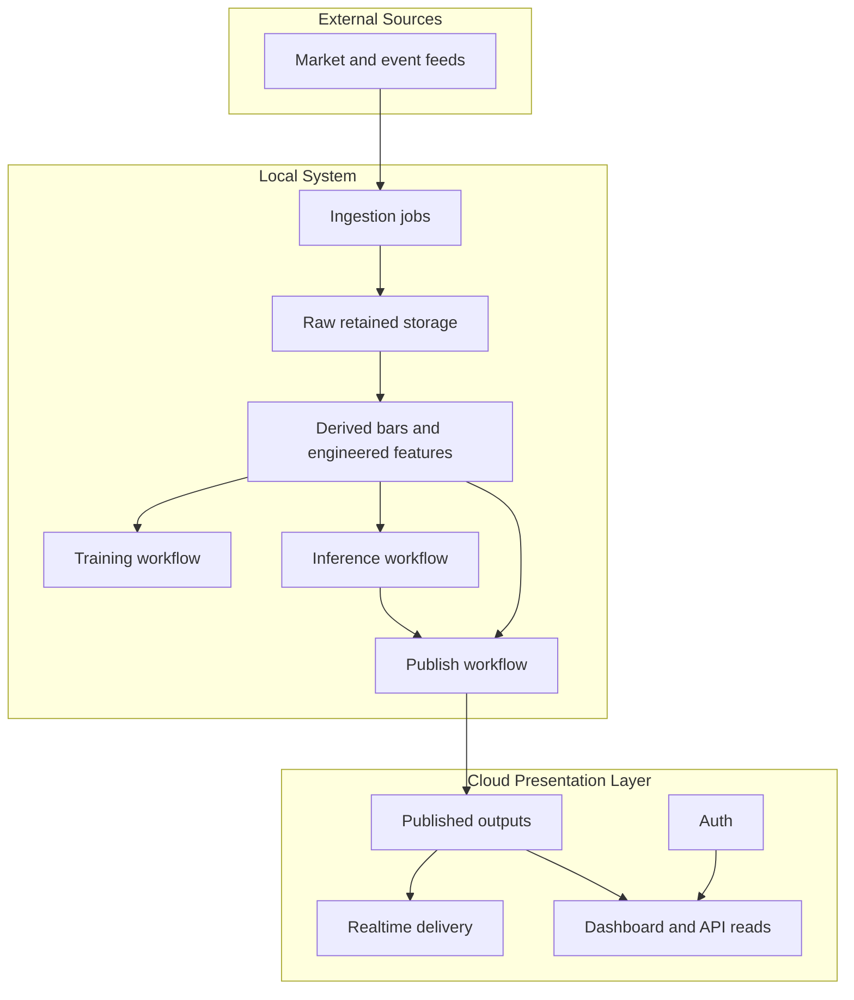

# Local-First PostgreSQL Training Architecture Guide

> ARCHIVED REFERENCE ONLY. Do not update this file.  
> Active architecture/update doc: `docs/plans/2026-03-20-ag-teaches-pine-architecture.md`

## Goal

Use a local PostgreSQL-based system as the working data and training environment, while using a cloud database only for presentation, sharing, and dashboard delivery.

## Core Principles

1. Land all raw source data locally first.
2. Keep retained history in the local database.
3. Build aggregates and engineered features locally.
4. Train and infer locally from immutable feature snapshots.
5. Publish only curated outputs to the cloud layer.
6. Keep presentation concerns separate from training concerns.

## Recommended Architecture

## Architectural Instructions

### 1. Raw local storage

- Use append-only raw tables for source history.
- Partition or hypertable raw time-series storage by time.
- Retain the full training history needed for model reproducibility.
- Keep ingestion logs and validation logs locally.

### 2. Derived local layers

- Build higher-timeframe aggregates locally.
- Build engineered feature tables locally.
- Separate raw storage from derived storage.
- Prefer scheduled or incremental refresh patterns over ad hoc query-time computation.

### 3. Training dataset design

- Create immutable feature snapshot rows.
- Make each row represent one model decision point.
- Keep target labels versioned by horizon and objective.
- Prevent leakage with time-aware validation, purge, and embargo rules.

### 4. Local training boundary

- Train on local feature snapshots only.
- Persist models locally.
- Record model metadata, training windows, and feature schema locally.
- Keep experimentation and model artifacts outside the cloud presentation layer.

### 5. Local inference boundary

- Score new rows locally first.
- Write local inference outputs to dedicated local tables.
- Treat inference as a separate stage from publication.

### 6. Cloud publication layer

- Publish only curated signals, summaries, setup state, and dashboard-ready outputs.
- Do not publish the full retained raw training warehouse unless there is a hard operational reason.
- Use the cloud layer for auth, dashboard reads, realtime, and lightweight APIs.

### 7. Operational rules

- Keep the local database as the system of work.
- Keep the cloud database as the system of presentation.
- Use containers or local infrastructure only when needed.
- Stop local infrastructure when heavy training needs host memory.
- Avoid naming patterns that imply throwaway revisions.

### 8. Decision rule for high-frequency data

- Only retain higher-frequency layers if they provide clear value to feature quality or execution logic.
- If a higher-frequency layer exists only to support chart responsiveness, keep it ephemeral and separate from the retained training warehouse.

## Expected Outcome

This pattern produces a reproducible local research and training system, while keeping the cloud layer small, secure, and focused on delivery.
