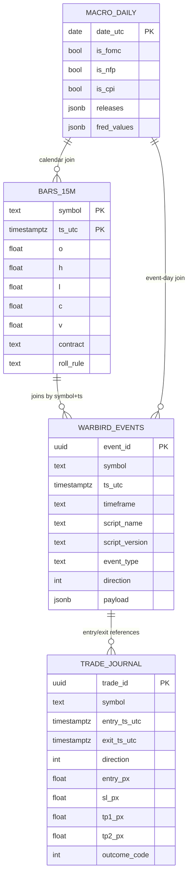
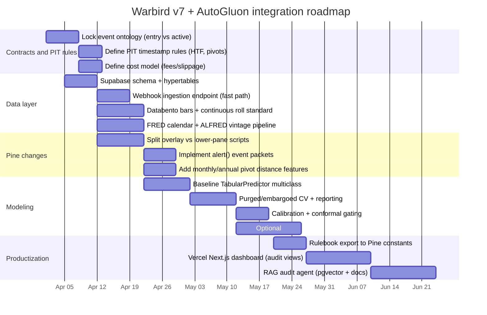

# Integrating AutoGluon 1.5 With Warbird v7 for Precise Entries + Fib TP1/TP2

> **Historical 2026-04-26:** This research predates the indicator-only reset.
> Ignore Supabase event-schema, external feature-stack, and warehouse training
> recommendations for active work.

## Executive summary

Warbird v7 already has the right *structural primitives* to become “smart”: non-lookahead gating, a canonical fib engine with TP1=1.236 and TP2=1.618, explicit intermarket regime scoring, and an explicit trade outcome label surface (`ml_last_exit_outcome`). fileciteturn1file0 The bottleneck is not “more indicators”; it’s **(1) governance of point‑in‑time (PIT) semantics**, **(2) a clean event schema in Supabase**, and **(3) an ML loop that meta-labels candidate setups instead of learning entries from scratch**.

The single biggest Pine-side constraint is the **plot/alert budget**: TradingView caps scripts at **64 plot counts**, and `alertcondition()` contributes to that count. citeturn2search6turn15view1 Warbird v7 is presently engineered near the ceiling (63/64). fileciteturn1file0 That makes a **companion lower-pane indicator** not optional if you want more exports, more diagnostics, or less risk of future feature creep breaking compilation.

On the export-to-ML side, **use `alert()` JSON packets**, not plot placeholders or extra `alertcondition()` calls. TradingView documents that `alert()` calls **do not contribute** to plot count and that *all* `alert()` calls count as **one alert** (from a plan quota perspective), while `alertcondition()` calls do contribute to plot count. citeturn15view1turn15view2 TradingView webhooks send an HTTP POST with the alert message in the request body; if it’s valid JSON, TradingView sets `Content-Type: application/json`. citeturn15view0 The hard operational constraint is the **15 triggers / 3 minutes** auto-stop limit per alert. citeturn14search3turn14search1 This forces you to emit packets **only on state changes / events**, not every bar.

Data-wise, your Databento Standard CME plan is a solid base for OHLCV + core reference data, but **it is not sufficient for long-horizon L2/L3 liquidity features unless you pay usage-based for extended depth history**. Databento’s own pricing page states Standard includes **entire history in core schemas**, but only **1 year of L1** and **1 month of L2/L3** history (then usage-based). citeturn9view0turn10view0 Liquidity and volume delta “done right” typically require **trade-side** (aggressor) and/or **book depth** signals (MBP-1/MBP-10/MBO). Databento’s `trades` and `TBBO` schemas explicitly include aggressor side, which is the authoritative basis for buy/sell volume delta and CVD-style features. citeturn16search1turn16search8turn7search3

Unspecified items (must be made explicit before the ML loop is production-grade): instrument universe (ES only vs multi), exact bar timeframe(s) used for training, dataset span, roll rule for continuous futures, the definition of “expire” (TTL in bars), slippage/fees model, and whether ML controls *take/skip only* or also modifies stops/entries.

## Indicator audit

### Non-repaint and PIT correctness

Warbird v7’s stated no-repaint posture is coherent:

- It gates structure logic on `barstate.isconfirmed` (bar-close semantics). fileciteturn1file0  
- It uses `request.security(..., lookahead=barmerge.lookahead_off)` everywhere in the code shown, which aligns with TradingView’s warnings that HTF requests and realtime bars can repaint if you accidentally access unconfirmed HTF values. fileciteturn1file0 citeturn3search0turn3search5turn3search1  
- TradingView also recommends avoiding intra-bar alerting if you care about confirmation; using “Once per bar close” is the simplest operational mitigation. citeturn15view2turn15view2

The subtle PIT risk is **pivot confirmation lag** and “shifted timestamps” for any pivot-based event:

- Your CHoCH detection uses `ta.pivothigh/ta.pivotlow` with `rightbars=5`, which by definition confirms only after future bars exist; your script already calls out that the event “fires on bar N+5” and that the training pipeline must timestamp at the **emit bar** (not the pivot bar) to avoid forward-shift leakage. fileciteturn1file0  
- Your Auto Fib anchor uses a ZigZag library and updates anchors when a new pivot is confirmed (`fibZZ.update()` then `lastPivot()`), which strongly suggests **non-repainting but delayed** pivots—good for execution reliability, but it means entries are always “late” relative to the raw turning point. fileciteturn1file0 This is not a bug; it is the tradeoff for non-lookahead.

### Pivot logic and the fib engine

Fib engine correctness for your key requirement is clean:

- Canonical extensions are hard-coded: `FIB_T1 = 1.236` and `FIB_T2 = 1.618`. fileciteturn1file0  
- Targets are computed direction-aware through `fibPrice(ratio)` using `fibDir` and `fibBase`, with the regime direction decided by a midpoint + hysteresis band. fileciteturn1file0  
- TP1 and TP2 are assigned directly from the canonical computed levels: `tp1Level = pT1` and `tp2Level = pT2`. fileciteturn1file0  
- Stop is symmetric via `fibPrice(-0.236)` (an invalidation extension beyond the anchor). fileciteturn1file0  

Two design choices that matter for ML integration:

- **`minTargetPoints = 20`** is a fixed-value viability gate for TP1 eligibility. fileciteturn1file0 Fixed point thresholds are almost always regime-dependent in futures; ML should learn the “minimum viable distance” as a function of volatility (e.g., ATR, session segment, regimeScore). Keeping it hard-coded bakes in bias.  
- Direction inference `fibBull` depends on *close relative to fib midpoint* (plus hysteresis). fileciteturn1file0 This is stable and easy for ML to consume, but note it is **not the same** as “trend.” Your ML should treat `dir` as “fib bias,” not as a trend label.

### EntryLongTrigger vs trade state

This is the crux for training correctness.

Warbird defines two different concepts of “entry”:

- `entryLongTrigger` / `entryShortTrigger` fire on **acceptEvent** + direction + TP distance + conflict filters + **RVOL gate**. fileciteturn1file0  
- The internal trade state machine enters `TRADE_SETUP` when price trades into a zone around the fib entry level, and then flips to `TRADE_ACTIVE` when `regimeAligned`—**without RVOL gating**. fileciteturn1file0  

Implication: your “alert-level entry” and your “journaled trade entry” can diverge materially. This is not academic—this is the difference between a stable supervised dataset and a mislabeled mess.

Recommendation (rigorous): pick **one canonical event ontology**, then enforce it everywhere:

- If you want ML to meta-label “what Warbird would have entered,” then define candidate events on `entryLongTrigger/entryShortTrigger` (since it’s closer to the intended discretionary standard) and make the trade state machine respect the same gates (especially RVOL) so the labels match the trigger.  
- If you want “what the state machine actually did,” then export *that* as the canonical entry and stop pretending the trigger is the entry.

### Plot and alert limits

Warbird v7 is already engineered against TradingView’s ceilings:

- TradingView’s plot count limit is **64**, and `alertcondition()` contributes to plot count. citeturn2search6turn15view1  
- Warbird’s header states a budget near the ceiling (63/64). fileciteturn1file0  
- TradingView also limits unique `request.*()` calls to **40** (or 64 on the Ultimate plan), and Warbird reports 11/40 in-use. fileciteturn1file0 citeturn13search0turn13search4turn13search11  

This strongly supports a **two-script architecture**:
- Overlay script: anchors, fib levels, minimal operator marks, and **event triggers**.
- Lower-pane script: regime diagnostics, feature computation you may want to iterate on, and packet emission.

## Dataset readiness audit for Supabase and time-series storage

### Why TimescaleDB fits your design

TimescaleDB is a Postgres extension designed for time-series. Supabase documents it as a scalable, high-performance solution for storing/querying time-series data and shows how to create hypertables. citeturn5search1turn0search1

For your workload, hypertables matter because:
- `bars_15m` will accumulate quickly across instruments and years.
- `warbird_events` is also time-indexed and join-heavy (events → surrounding bars → macro daily).

### Concrete DDL examples

Below is an opinionated schema that is strict enough for PIT ML, but flexible enough for rapid iteration. (Assume everything about instruments/timeframes as “unspecified” until you lock the scope.)

```sql
-- Enable required extensions in Supabase
create extension if not exists timescaledb with schema extensions;
create extension if not exists vector with schema extensions; -- for RAG later

-- Core bars table (Databento-sourced or canonical bars used in training)
create table if not exists public.bars_15m (
  symbol text not null,                 -- e.g. "ES", "NQ", "RTY" (unspecified symbology standard)
  ts_utc timestamptz not null,          -- bar open time in UTC
  o double precision not null,
  h double precision not null,
  l double precision not null,
  c double precision not null,
  v double precision not null,
  -- recommended metadata
  venue text null,                      -- e.g. "CME"
  contract text null,                   -- resolved contract (e.g., "ESM2026") if you roll
  roll_rule text null,                  -- e.g. Databento "v" or "n" (unspecified)
  primary key (symbol, ts_utc)
);

-- Convert to hypertable (chunk interval depends on scale; start with 7 days)
select create_hypertable('public.bars_15m', by_range('ts_utc', interval '7 days'), if_not_exists => true);

create index if not exists bars_15m_ts_idx on public.bars_15m (ts_utc desc);
create index if not exists bars_15m_symbol_ts_idx on public.bars_15m (symbol, ts_utc desc);

-- Warbird event packets (from TradingView alerts)
create table if not exists public.warbird_events (
  event_id uuid primary key default gen_random_uuid(),
  symbol text not null,
  ts_utc timestamptz not null,          -- event bar open or bar close time? choose one and lock it.
  timeframe text not null,              -- e.g. "15"
  script_name text not null,            -- e.g. "WBv7_overlay", "WBv7_pane"
  script_version text not null,         -- e.g. "2026-03-31"
  event_type text not null,             -- "accept", "entry_trigger", "entry_active", "exit", etc.
  direction smallint null,              -- +1 long, -1 short, 0 neutral
  payload jsonb not null,               -- full raw JSON packet
  -- key extracted fields for fast filtering
  regime_score double precision null,
  impulse_quality double precision null,
  confidence_score double precision null,
  fib_t1 double precision null,
  fib_t2 double precision null,
  sl double precision null,
  entry_level double precision null
);

select create_hypertable('public.warbird_events', by_range('ts_utc', interval '14 days'), if_not_exists => true);

create index if not exists warbird_events_symbol_ts_idx on public.warbird_events (symbol, ts_utc desc);
create index if not exists warbird_events_type_ts_idx on public.warbird_events (event_type, ts_utc desc);
create index if not exists warbird_events_payload_gin on public.warbird_events using gin (payload);

-- Trade journal (canonical labels after reconciliation)
create table if not exists public.trade_journal (
  trade_id uuid primary key default gen_random_uuid(),
  symbol text not null,
  entry_ts_utc timestamptz not null,
  exit_ts_utc timestamptz null,
  direction smallint not null,          -- +1 / -1
  entry_px double precision not null,
  sl_px double precision not null,
  tp1_px double precision not null,
  tp2_px double precision not null,
  outcome_code smallint not null,       -- 1=TP1, 2=TP2, 3=STOP, 4=EXPIRE (match Warbird)
  mae double precision null,            -- maximum adverse excursion (in points)
  mfe double precision null,            -- maximum favorable excursion (in points)
  fees double precision null,           -- optional
  slippage double precision null        -- optional
);

create index if not exists trade_journal_symbol_entry_idx on public.trade_journal (symbol, entry_ts_utc desc);

-- Macro daily table (FRED + release calendar joins)
create table if not exists public.macro_daily (
  date_utc date primary key,
  is_fomc boolean default false,
  is_nfp boolean default false,
  is_cpi boolean default false,
  releases jsonb null,                  -- optional: store calendar events
  fred_values jsonb null                -- optional: store series values used that day
);
```

TimescaleDB hypertables and chunking are official Timescale patterns referenced in Supabase’s Timescale guide. citeturn5search1turn0search1 Supabase also supports Edge Functions for receiving webhooks, which is relevant if you choose to ingest TradingView payloads directly into Supabase. citeturn5search0turn5search4

### RLS and ingestion keys

In production you will enable Row Level Security on public tables and ingest via a server-side role. Supabase documents that service role keys can bypass RLS and must never be exposed in the browser. citeturn5search2turn5search6

## Feature engineering: what you have, what you’re missing, what you don’t need

### What Warbird already provides as PIT-safe features

Warbird exports a large PIT-safe feature set (hidden plots) including:

- Regime state and score (`im_regime`, `ml_regime_score`), alignment counts, agreement velocity, impulse quality. fileciteturn1file0  
- Liquidity sweep and CHoCH signals as signed features. fileciteturn1file0  
- FVG distances, exhaustion score, opening range state/distance, RVOL, SL distance in ATR. fileciteturn1file0  
- HTF fib confluence hits for 1H/4H/D. fileciteturn1file0  

This already matches a large portion of the “Smart Money Concepts” conceptual stack that LuxAlgo describes (liquidity sweeps, structure shifts, FVGs, multi-timeframe levels). citeturn7search0turn7search2turn7search8turn7search19

### What you are missing (and should add) based on authoritative sources

#### True volume delta and CVD-grade signals

Your current “delta” is a proxy computed from bar CLV (close location value) and volume. fileciteturn1file0 That is not the same as **aggressor-side delta**.

LuxAlgo’s own educational definition of CVD is aggressor-based (buying volume at/above ask vs selling volume at/below bid). citeturn7search3 Databento provides this authoritatively:

- `trades` schema: includes `side` = aggressor side (Bid = buy aggressor, Ask = sell aggressor). citeturn16search1  
- `TBBO` schema: also includes aggressor side, with BBO context immediately preceding each trade. citeturn16search8  

**Needed** (if delta is a “highly critical” feature): store aggregated per-bar values computed from `trades` or `TBBO`:
- buy_volume, sell_volume
- delta = buy - sell
- delta% = delta / total
- CVD (cumulative delta) reset by session

**Databento plan implication**: Standard includes limited L1 and depth history; if you want multi-year CVD, you will likely need usage-based historical pulls for `trades`/`TBBO` beyond what is included. citeturn9view0turn10view0

#### Liquidity depth and “don’t buy into the wall” signals

“Liquidity” in ICT/SMC terms (sweeps) is different from book liquidity depth. You have sweeps. fileciteturn1file0 If you want book liquidity (stacked resting orders, absorption, thinning), you need L1/L2/L3 features:

- MBP-1 is top-of-book updates (L1). citeturn16search11  
- MBP-10 is top-10 depth with size and order count (L2). citeturn16search4  
- MBO is full depth by order ID (L3). citeturn0search11turn16search22  

Databento’s own microstructure examples show calculating book imbalance and related features from order book depth. citeturn16search2turn16search17

**What’s actually needed vs not needed given your goal**:

- If your goal is *entry filtering + TP1/TP2 probability*, you usually don’t need full L3. MBP-10 is often sufficient to estimate imbalance, depth slope, and “liquidity ahead” (depth between entry and pivot). citeturn16search4turn16search2  
- Full MBO becomes necessary when you care about queue position, order-level cancellations, and advanced absorption modeling. citeturn0search11turn9view3  

Given Standard includes only **1 month** of L2/L3 history by default, build the system so the ML baseline works **without** deep book history; then add MBP-10 features as a paid upgrade to the model later. citeturn9view0turn10view0

#### Monthly/quarterly/annual pivots explicitly

Your stated failure mode (“don’t go long into a massive monthly or annual pivot 10 points in front of it”) is solvable without new data feeds:

- Compute rolling **monthly/quarterly/yearly highs/lows**, prior period VWAP, and distance-to-level in ATR units from your canonical bar series (daily bars at minimum).  
- LuxAlgo’s SMC overview explicitly highlights “Daily-to-Monthly Highs & Lows” as part of the level stack on intraday charts. citeturn7search19  

In Pine, add features like:
- `dist_to_prev_month_high_atr`, `dist_to_prev_year_high_atr`
- `tp1_crosses_major_level` / `tp2_crosses_major_level` (boolean)
These are “cheap” and high-leverage.

#### Macro day labeling with FRED release calendar + vintage control

Warbird currently uses a heuristic event-day proxy (NFP/FOMC/CPI date heuristics) and explicitly says to join the economic calendar server-side for exact dates. fileciteturn1file0

FRED provides:
- A release calendar page for exact dates. citeturn1search1  
- API endpoints for series and observations. citeturn1search6turn1search0  
- FRED API Version 2 for **bulk release observations**. citeturn1search2turn1search8  
- ALFRED for **vintage (as-of-date) data**, which is critical to avoid training on revised macro prints (look-ahead leakage). citeturn1search9turn1search11  

## Labeling strategy and validation

### Candidate setups vs actual entries

Your dataset must separate:

- **Candidate setups**: any bar where Warbird identifies a setup archetype (accept/reject/breakAgainst/etc.), regardless of whether you entered. fileciteturn1file0  
- **Executed entries**: the specific entry event you decide is canonical (either `entryLongTrigger/entryShortTrigger` or `TRADE_ACTIVE` flip). fileciteturn1file0  

Why: if you train only on executed entries, ML can only learn *conditional on your current rules*, and you’ll never learn when to skip or when a rejected setup was actually best. This is the core meta-labeling rationale in modern trading ML.

### Multi-class outcomes aligned to Warbird

Warbird already encodes:
- `lastExitOutcome`: 1=TP1, 2=TP2, 3=STOP, 4=EXPIRED, and it documents this as the **primary label surface** because trade_state resets to NONE on exit. fileciteturn1file0  

Use that as the canonical target to avoid ambiguous reconstruction.

### Purged/embargoed CV and why it is not optional

Financial labels overlap in time: TP/SL outcomes depend on future path. Standard K-fold leaks.

López de Prado’s framework advocates **Purged K-Fold** and **embargo** concepts to remove overlap and reduce leakage. citeturn4search3turn4search9 A practical implementation:

- Split by time blocks.
- Purge training rows whose label windows overlap test windows.
- Embargo a small period after each test fold.

This matters more than any model choice.

## AutoGluon experiment design

### Primary model: TabularPredictor for multi-class outcome + meta-labeling

AutoGluon’s TabularPredictor is designed for supervised tabular learning; its docs recommend presets like `best_quality` (and `extreme_quality` for maximum performance) as the default path. citeturn2search0turn2search12turn2search16

Two-stage design (recommended):

1) **Outcome model** (multi-class): predict `P(TP2), P(TP1), P(STOP), P(EXPIRE)` at candidate event time.
2) **Meta-label** (binary take/skip) built on top of the existing trigger: label = whether the expected value is positive after costs, or whether TP2 probability exceeds threshold.

### Auxiliary model: TimeSeriesPredictor for regime/range forecasts

AutoGluon’s TimeSeriesPredictor supports known covariates (exogenous features known in advance) and a selectable `eval_metric`. citeturn2search1turn2search17 The best use here is not “predict price,” but:

- forecast **future realized volatility** or **range** (e.g., next N bars ATR proxy),
- forecast **regimeScore drift** or “risk-on persistence,”
- forecast **liquidity risk** proxies (session + macro day + calendar).

These forecasts become covariates for the TabularPredictor.

### Calibration and conformal prediction for “precision triggers”

Your execution logic will threshold probabilities. If probabilities are miscalibrated, thresholds fail.

- Scikit-learn documents `CalibratedClassifierCV` and probability calibration workflows. citeturn4search2turn4search5  
- Conformal prediction provides set-valued predictions with validity guarantees under exchangeability assumptions (Shafer–Vovk tutorial). citeturn4search1turn4search7  

In practice:
- Calibrate the multi-class probabilities (Platt/isotonic-style) on a proper time-split validation set.
- Use conformal wrappers to only trade when the prediction set is “tight” (low ambiguity), which is exactly what “precise triggers” means operationally.

### Training pipeline pseudocode (local)

```python
# Pseudocode: training loop
# - Pull events + bars + macro from Supabase
# - Join Databento-derived features (trades/TBBO/MBP-10) if available
# - Construct candidate event rows
# - Purged/embargoed CV splits
# - Train AutoGluon TabularPredictor
# - Calibrate probabilities
# - Compute expected value + thresholds
# - Export a Pine "rulebook" (regime bucket -> params)

events = load_supabase("warbird_events")
bars   = load_supabase("bars_15m")
macro  = load_supabase("macro_daily")

# 1) Candidate events selection
candidates = events.filter(event_type in ["accept", "setup_archetype", "entry_trigger"])

# 2) Feature assembly (PIT-safe joins)
X = assemble_features(candidates, bars, macro, databento_features=maybe)

# 3) Labels
y = candidates["outcome_code"]  # derived from lastExitOutcome logic or trade_journal

# 4) Time-aware CV
splits = purged_embargoed_time_splits(X, y, label_horizon="until_exit_or_ttl")

# 5) Train
predictor = TabularPredictor(label="outcome_code",
                             problem_type="multiclass",
                             eval_metric="log_loss").fit(
    train_data=X_train,
    presets="best_quality"
)

# 6) Calibrate (post-hoc)
calibrator = fit_calibrator(predictor, X_calib, y_calib)

# 7) Evaluate (see metrics below)
metrics = evaluate(predictor, calibrator, X_test, y_test,
                   costs={"fees":..., "slippage":...})

# 8) Export
rulebook = derive_rulebook(metrics, constraints={"max_alert_rate":...})
write_pine_constants(rulebook)
```

### Evaluation metrics to report (required)

- **Per-class precision/recall** (TP1, TP2, STOP, EXPIRE), macro-F1.
- **Calibration**: Brier score, ECE, reliability curves.
- **Trading utility**: expected value (EV) per trade, EV by regime bucket, simulated P&L including cost model.
- **Risk**: max drawdown, distribution of consecutive losses, tail loss on macro days.

## Deployment loop and Pine architecture

### Export packets via `alert()` JSON webhooks

Authoritative mechanics:

- TradingView sends webhooks as HTTP POST with the alert message in the body; valid JSON becomes `application/json`. citeturn15view0  
- Alerts can send JSON built by concatenating strings (TradingView docs explicitly state Pine has no JSON builder, so you hand-construct). citeturn2search3turn18search2  
- `alert()` messages are dynamic series strings and support frequency controls like `alert.freq_once_per_bar_close`. citeturn15view2turn12search0  

Hard constraint: alert auto-stop at 15 triggers per 3 minutes. citeturn14search3turn14search1

#### Sample `alert()` JSON payload (event packet)

```json
{
  "ts_utc": "{{time}}",
  "symbol": "{{ticker}}",
  "timeframe": "15",
  "script": "WBv7_overlay",
  "script_version": "2026-03-31",
  "event_type": "entry_trigger",
  "dir": 1,
  "entry_px": "{{close}}",
  "levels": {
    "entry": 618.0,
    "sl":  -0.236,
    "tp1": 1.236,
    "tp2": 1.618
  },
  "features": {
    "regime_score": 72.3,
    "impulse_quality": 81.0,
    "rvol": 1.45,
    "exhaustion": 22.1,
    "liq_sweep": 1,
    "choch": 0,
    "htf_conf_total": 3
  }
}
```

In Pine you’d build this as a string; then call `alert(payload, alert.freq_once_per_bar_close)` only when a key event occurs. citeturn15view2turn2search3

### Can a second indicator send the same packets to AutoGluon? Can multiple indicators work?

Yes—with strict discipline.

- Multiple indicators can each issue webhook posts (each alert is a separate server-side alert instance). TradingView webhooks are configured per alert, and each will POST to the URL you provide. citeturn15view0turn14search2  
- `alert()` calls don’t consume plot budget and don’t increment the script’s plot count, which makes them ideal for a “packet emitter” script. citeturn15view1turn15view2  
- The rate limit still applies per alert (15 per 3 minutes), so splitting into multiple indicators only helps if you (a) truly need more emission volume and (b) accept the operational risk of multiple alerts halting independently. citeturn14search3  

What you **cannot** do reliably is have scripts share internal variables. Pine scripts are isolated; they can only “connect” via external inputs that reference another script’s plotted values via `input.source()`, with documented limits (up to ten plots in some contexts). citeturn19search10turn19search18turn19search7 That mechanism is not suitable for a full feature bus.

### Recommended Pine changes (high leverage)

**Split into two scripts** (strong recommendation):

- **WBv7 Core Overlay**
  - fib anchors, fib levels, zone/accept/reject logic
  - canonical TP1/TP2 + SL
  - minimal on-chart visuals
  - emits only: setup + entry + exit events

- **WBv7 Diagnostics + Export (Lower Pane)**
  - regime labels, agreement velocity, impulse quality
  - expensive or iterative feature experiments
  - emits feature packets keyed by event_id from core (see below)

Because you cannot share variables directly, you coordinate via the webhook ingestion layer:

- Core overlay emits `event_type=entry_trigger` with a generated `event_uuid` embedded in payload.
- Pane script emits `event_type=features_snapshot` on the same bar with the same bar timestamp + symbol; ingestion service matches them by `(symbol, ts_utc, timeframe)` and merges payloads. TradingView includes symbol/time placeholders for alerts, and you control the JSON you build. citeturn15view0turn15view2

This yields Lux-style modularity without violating Pine’s isolation model.

### Webhook handling: Vercel Function vs Supabase Edge Function

Both are legitimate.

- Supabase Edge Functions are explicitly positioned for “listening to webhooks.” citeturn5search0  
- Vercel supports webhooks and server-side Functions for handling HTTP requests. citeturn0search3turn0search14turn0search18  

Your stack implies:
- ingestion endpoint on Vercel Function (Next.js API route) → insert into Supabase using service role
- or ingestion endpoint on Supabase Edge Function → write directly into Supabase, then Next.js reads.

If you’re optimizing for reliability under TradingView’s 3-second webhook timeout and IP allowlisting constraints (documented by TradingView), keep the ingestion function extremely fast: validate + enqueue/insert minimal row, avoid heavy processing. citeturn15view0

## Audit-agent / RAG design inspired by LuxAlgo

Your ask here is not “copy LuxAlgo.” It’s “build an internal audit brain” that:

- knows Warbird code semantics,
- knows TradingView/Pine constraints,
- knows how your dataset is constructed, and
- can audit model + script behavior with a consistent rubric.

### Architecture

Use Supabase as both your relational store and vector store:

- Supabase documents `pgvector` for embeddings and vector similarity search; the extension name is `vector`. citeturn11search0turn11search1  
- Supabase provides semantic search guidance and supports embedding tables. citeturn11search1turn11search3  

For the agent layer, the Vercel AI SDK has a cookbook guide for building a RAG chatbot. citeturn11search2

### What documents to ingest

- Warbird v7 code versions + changelogs (each commit as a document)
- Your own “data contract” docs: feature definitions, label definitions
- LuxAlgo educational posts used as conceptual references (liquidity sweeps, MSS, FVG, CVD) citeturn7search0turn7search2turn7search3turn7search8  
- TradingView official docs: alerts/webhooks, limitations, repainting, time semantics citeturn15view0turn2search6turn3search0turn17search0  
- Databento schema docs for formal definitions (trades/TBBO/MBP/MBO, continuous symbology) citeturn16search1turn16search8turn6search8turn6search2  
- FRED calendar + API v2 docs + ALFRED rationale citeturn1search1turn1search2turn1search9  

### Why this matters

An audit agent becomes your internal Lux-style reviewer that can answer:
- “This entry lost because TP2 was blocked by last month’s high, and the model probability was uncalibrated in low-vol mid-day regimes.”
- “These features are collinear; remove them.”
- “This label leaks because the CHoCH pivot is timestamped to the pivot bar instead of the emit bar.”

That is operationally valuable and realistically implementable with your stack.

## Wins, losses, opportunities: Warbird now vs proposed system

| Dimension | Current Warbird v7 | Proposed integrated system | Win/Loss opportunity |
|---|---|---|---|
| Fib engine + TP levels | Canonical TP1=1.236, TP2=1.618, direction-aware engine | Keep engine; ML predicts probability of reaching TP1/TP2 given context | Keep; ML adds selectivity fileciteturn1file0 |
| Entry definition | Two notions (entryTrigger vs tradeState entry) | Single canonical event ontology; unify state machine + triggers | Large leakage/label risk to remove fileciteturn1file0 |
| Non-repaint | Bar-close semantics + lookahead_off | Keep; enforce PIT in data pipeline | Strong foundation citeturn3search0turn15view2 fileciteturn1file0 |
| Liquidity | ICT-style sweeps + FVG distances | Add book-depth metrics when available; keep sweep features | Depth features optional/paid upgrade citeturn16search4turn16search2turn9view0 |
| Volume delta | CLV-based proxy | Aggressor-side delta from `trades`/`TBBO` (+ optional CVD) | Strong improvement if you can afford history citeturn16search1turn16search8turn9view0 |
| Macro regime | Heuristic event-day proxy | FRED release calendar + API v2 + ALFRED for vintage | Major leakage risk reduction citeturn1search1turn1search2turn1search9 fileciteturn1file0 |
| Export mechanism | Hidden plots + 3 alertconditions near plot cap | Event-driven `alert()` JSON packets; optional two-script merge | Removes plot bottleneck + placeholder limits citeturn15view1turn15view0turn2search6 |
| Model validation | Unspecified | Purged/embargoed CV + calibration + conformal gating | Required for credible edge citeturn4search3turn4search1turn4search5 |

## Implementation timeline and checklist

### Mermaid ER diagram (conceptual)



### Mermaid Gantt timeline with milestones



### Checklist for data collection and labeling (actionable)

Data contract and PIT
- Choose canonical “entry” event (`entry_trigger` vs `trade_active`) and enforce it in Pine + labels. fileciteturn1file0  
- Define the timestamp convention: bar open vs bar close; be consistent across TradingView alerts and Databento bars. citeturn15view0turn16search15  
- Encode script_version in every packet (Warbird already timestamps versions in comments). fileciteturn1file0  

Market data completeness
- Confirm your continuous futures roll rule matches TradingView’s semantics; Databento continuous symbology uses `[ROOT].[ROLL_RULE].[RANK]`. citeturn6search8turn6search2  
- Start with OHLCV bars for the full training period. citeturn0search7turn9view0  
- If delta is “critical,” budget for `trades` or `TBBO` history beyond what Standard includes. citeturn16search1turn9view0  
- If depth is “critical,” budget for MBP-10 history beyond Standard’s included month. citeturn16search4turn9view0  

Macro labeling
- Replace heuristic event-days with FRED release calendar joins; optionally use FRED API v2 for bulk release observations. citeturn1search1turn1search2turn1search8  
- Use ALFRED vintages for any macro series used as features to avoid revised-data leakage. citeturn1search9turn1search11  

Alerts and ingestion reliability
- Use event-driven `alert()` packets (not per-bar spam) to avoid TradingView 15/3min auto-stop. citeturn14search3turn15view2  
- Keep webhook handler under TradingView’s 3-second timeout; do minimal work and insert to DB fast. citeturn15view0  
- Do not include secrets in the webhook body; TradingView explicitly warns against transmitting sensitive information in webhook bodies. citeturn15view0  

### Direct answers to your last two questions

A second lower-pane indicator is recommended, not optional, if you want to keep improving Warbird without constantly fighting plot/alert limits. TradingView’s plot-count limit is hard (64), and Warbird is already near it. citeturn2search6turn15view1 fileciteturn1file0

Two (or more) indicators can absolutely send packets to AutoGluon via webhooks: each alert can POST JSON to your ingestion endpoint. citeturn15view0turn15view1 The critical engineering requirement is to **treat the server-side ingestion layer as the “bus”** that merges/joins packets by `(symbol, ts_utc, timeframe)` and deduplicates, because Pine scripts cannot share state except via limited external plot inputs. citeturn19search10turn19search18turn19search7
